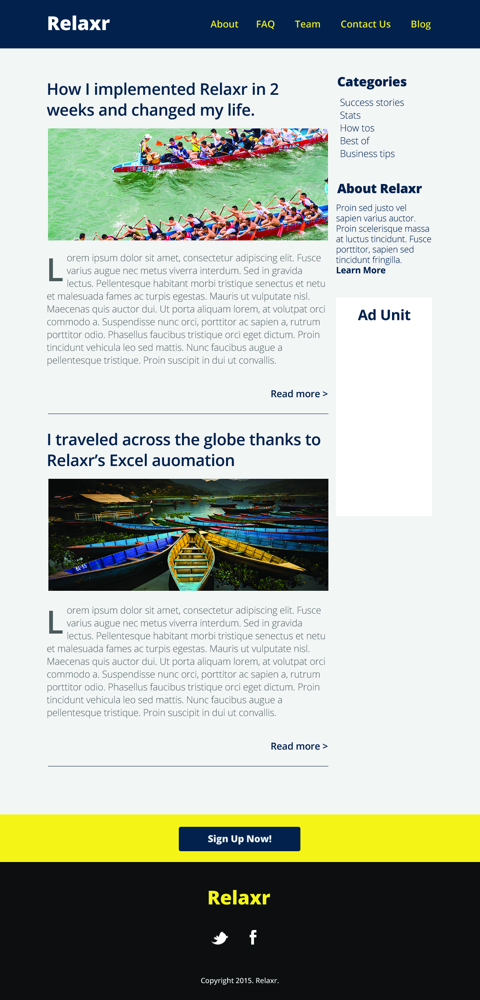

# css-layout-lab
# FEWD Week #3: CSS Layouts
As always, fork and clone this repository :)

 

---

### Description 

Super cool startup, Relaxr, wants you to build their landing page. The designers have handed you a basic [design file with instructions](design-specs.md) and the JPEG below to help you bring the blog to life. Submit the finished version for homework.

 

---

### Real-World Applications

- Build websites with multi-column layouts
- Turn complex design assets into code
- Style text on your page with Google Fonts

 

---

### Technical Requirements 
- Use Flexbox and / or Grid in your CSS to achieve a multi-column layout
- Follow the design guidelines established in the [specs](design-specs.md)
- Make your page look as similar as you can to the design file. 

#### Bonus
- Add a hover effect to all the links using pseudo-classes

